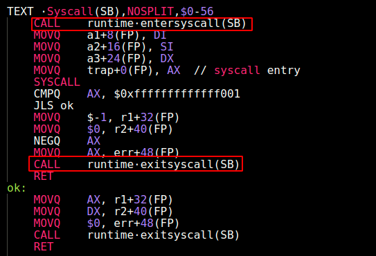
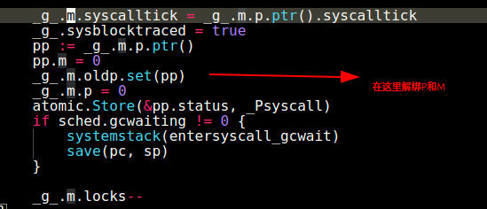
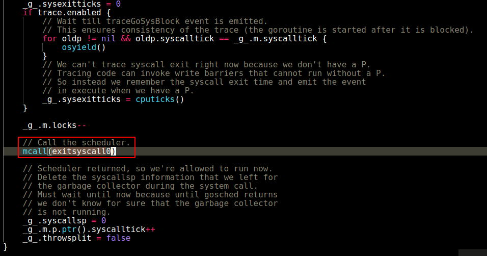
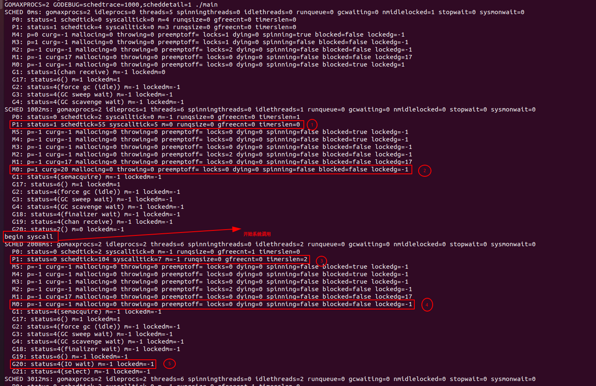
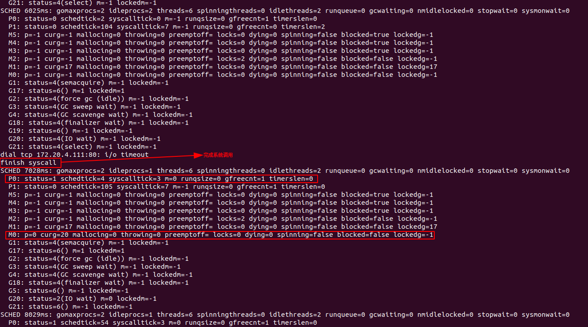

> 本文主要从实践的角度讨论了Golang中调度器工作的不同时机和处理方法
> 
> 本文的讨论基于golang 1.15.4版本

<!--more-->

## 1 概述

golang目前版本(1.15)使用了GMP调度模型，本文主要从实践的角度去理解golang调度器的一些原理，关于调度理论的详细解释，可以参考如下资源：

- 关于调度原理的理论讲解可以参考链接[\[1\]](https://medium.com/@ankur_anand/illustrated-tales-of-go-runtime-scheduler-74809ef6d19b)
- golang也提供了trace工具来收集调度数据，具体使用可以参考链接[\[2\]](https://making.pusher.com/go-tool-trace)
- 对于trace信息的解释，可以参考本文的附录，也可以参考[\[3\]](https://programming.vip/docs/looking-at-scheduling-tracking-with-godebug.html)

## 2 触发调度的时机以及处理方法

调度是为了保证cpu等物理资源得到充分的利用，那什么时候需要触发调度呢？答案一定是用户代码无法充分利用cpu等物理资源的时候才触发。通过调度这种方式，把cpu等物理资源的使用权让给其他调度单位，增加用户代码的执行效率。

对于线程或者协程而言，阻塞会导致物理资源的占用，无法执行其他待执行的用户代码，因此阻塞是触发调度的主要原因。除此之外，为了避免饥饿(Starvation)而使用的公平调度算法也会触发调度。在golang中常见的触发调度的事件有如下几种：

- 阻塞式系统调用
- 非阻塞系统调用
- 读写channel
- mutex的加锁和释放锁
- 定时器
- 公平调度算法引发的调度（本文暂未分析)

下面对上述情况依次进行分析。

## 2.1 阻塞式系统调用引发的调度

首先思考如果Goroutine进行了阻塞式的系统调用会发生什么？为了增加物理资源的使用率，这个时候应该触发调度，把物理资源让给其他Goroutine执行。那调度相关的逻辑处理怎么嵌入到系统调用中呢？golang的`syscall`包对系统调用进行了封装，在系统调用前后增加了部分调度相关的逻辑。以x86平台为例，具体实现位于`**/src/syscall/asm_linux_amd64.s**` 中 ， 代码如下：



对系统调用的封装

可以看到，golang使用了类似代理模式，在系统调用前后分别插入了如下函数：

- `runtime.entersyscall()`
- `runtime.exitsyscall()`

那么这两个函数做了什么呢？

- `runtime.entersyscall()` 实现了如下逻辑：
    1. 由于进行了系统调用，当前M（Machine）会阻塞
    2. 当前G对应的P(Processor)会与当前M(Machine）解绑
    3. 当前G对应的P(Processor)会绑定到一个其他可用M(Machine)上，继续执行P自己的任务队列中的其他G(groutines)
    4. 经过上面三步，本质上是**新启动了一个内核线程继续执行P中未完成的工作，原线程阻塞等待系统调用的结束**。golang通过这种方式保证了物理资源的充分利用
        - 这部分逻辑位于`/src/runtime/proc.c`中：



entersyscall() 函数

- `runtime.exitsyscall()` 实现了如下逻辑：
    - 当系统调用完成，G变为Runnable状态，`exitsyscall()`会调用`mcall()` 触发一个调度事件，把G放在可用的P中的任务队列中，等待执行
    - 这部分代码位同样位于`/src/runtime/proc.c`中



exitsyscall() 函数

### 2.1.1 验证阻塞式系统调用导致的M与P解绑

下面通过一个简单的示例来验证上面所说的理论是否正确，示例代码如下，代码功能可以参考注释：

package main

import (
    "fmt"
    "net"
    "sync"
    "time"
)

func main() {
    stopChan := make(chan struct{})
    wg := sync.WaitGroup{}
    wg.Add(1)
	// 2秒钟后停止 InfnityLoop
    go func() {
        timer := time.NewTimer(2 \* time.Second)
        <-timer.C
        close(stopChan)
    }() 

    go func() {
        defer wg.Done()
        sysCall(stopChan)
    }() 

    wg.Wait()
}
/\*\*
 \*  sysCall函数首先执行一个无限循环模拟cpu占用
 \*  2秒后停止循环，进行一个阻塞5秒的iowait系统调用
 \*  系统调用完成后继续进行无限循环
 \*/
func sysCall(stopChan chan struct{}) {
    // 首先开始无限循环，模拟cpu占用
    infinitLoop(stopChan)

    fmt.Println("begin syscall")
    // 这里通过对一个不存在的地址进行tcp连接来模拟耗时的阻塞式系统调用
    \_, err := net.DialTimeout("tcp", "172.20.4.111:80", 5\*time.Second)
    if err != nil {
        fmt.Println(err.Error())
    }   
    fmt.Println("finish syscall")

    // 系统调用结束后继续循环，模拟cpu占用
    ch := make(chan struct{})
    infinitLoop(ch)
}

func infinitLoop(stopChan chan struct{}) {
    for {
        select {
        case <-stopChan:
            return
        default:
        }   
    }   
}

执行如下命令编译、运行代码， 指定系统使用2个P（Processor）, 每秒输出一次调度信息：

```
go build main.go
GOMAXPROCS=2 GODEBUG=schedtrace=1000,scheddetail=1 ./main
```

程序执行大概10秒后按下`ctrl + c` 终止程序，可以得到如下输出(各个字段的具体含义可参考附录)：



系统调用后M与P解绑

从上图的输出中可以得到如下结论：

- 系统调用之前
    - 代码1处可以看出P1处于运行状态(status=1)
    - 代码2处可以看出M0正在与P1绑定，并且正在执行id为20的Goroutine
- 在系统调用完成之前
    - 代码3处可以看到由于系统调用，P1已经处于idle状态
    - 代码4处可以看到由于系统调用，M0已经空闲(p=-1, curg=-1)，不再与P1绑定
    - 代码5处可以看到此时G处于阻塞状态(status=4), 并且阻塞的原因是IO wait



- 在系统调用完成之后可以看到（上图）
    - 由于代码中的`infinityLoop()`函数，P0恢复为运行状态(status=1)
    - M0重新与P0绑定，开始执行用户代码(p=0 curg=20)

总结：可以看出，阻塞式的系统调用会引起M，与P的解绑，golang正是通过这种方式保证了groutine的并发度不被系统调用给阻塞掉，以达到充分利用物理资源的目的。**M与P解绑和重新绑定是通过操作系统的内核线程切换完成的，因此这种情况下调度的本质是真正的线程上下文切换。**

## 2.2 其他情况下的调度

### 2.2.1 非阻塞式系统调用引发的调度

Golang处理并发的编程范式是：**将所有的外部调用都进行阻塞式的处理，通过goroutine和channel来处理阻塞调用的并发问题**，这与其他语言使用future和callback是完全不同的思路。通过2.1部分可以看出，每一次阻塞式的系统调用都会新建一个内核线程并且进行线程切换，这种方案在频繁进行系统调用时候会发生什么呢？显而易见的，大量的内核线程会被创建出来，并且随着系统调用开始和结束，不断的进行线程上下文切换。这个问题在golang的http server中尤为明显，试想一下，如果golang的http server使用这种方案，是不是一夜回到解放前的BIO线程模型了？当前主流的网络框架的IO模型都使用IO多路复用模型，具体而言就是依靠`epoll/kquue/IOCP`等系统调用，使用Reactor模式处理网络请求，比如大名鼎鼎的`Netty` 网络框架。

golang在这方面是如何做的呢？`net/http` 包实现了名为`netpoller` 的结构体，进行了如下的工作：

- `netpoller` 使用`epoll/kqueue/IOCP`等非阻塞系统调用等待IO事件的到来
- 真正处理请求的goroutine阻塞在netpoller上
- 有IO事件到来时候`netpooler`就通知阻塞的goroutine开始工作

可以看出，`netpooler`实际上是一个非阻塞调用与阻塞调用之间的转换器，将非阻塞的系统调用成功应用在了**golang使用阻塞goroutine+channel的编程范式上了。** 而这种由netpooler引发的调度，实际上**操作系统的内核线程是无感的，从内核线程的视角看，执行的都是连续的内核空间代码。**

还有一个问题，就是netpooler是什么时候启动的呢？

runtime/proc.go:110

func main() {
    ...

    if GOARCH != "wasm" { // no threads on wasm yet, so no sysmon
        systemstack(func() {
            newm(sysmon, nil) // 在程序启动时候，启动sysmon m
        })
    }

    // Lock the main goroutine onto this, the main OS thread,
    // during initialization. Most programs won't care, but a few
    // do require certain calls to be made by the main thread.
    // Those can arrange for main.main to run in the main thread
    // by calling runtime.LockOSThread during initialization
    // to preserve the lock.
    lockOSThread()
    ...
}

- 编译好的程序入口位于"`**runtime/proc.go**"`， 执行`main()`函数时候会启动`sysmon`, 并绑定到一个M上执行
- `sysmon()`函数会启动`netpoller`

### 2.2.2 读取channel以及互斥锁引发的调度

对于channel和锁等待操作，同样都是在用户空间完成的。大致原理如下：

- channel拥有两个队列存储阻塞的goroutine, 这些goroutine阻塞在接收和发送数据的状态
- `mutex`也同样有队列存储阻塞等待的goroutine
- 一旦阻塞条件接触，阻塞的`goroutine` 就变为`runnable` 状态，加入到某个P的任务队列中

这部分的调度同样对操作系统内核线程是透明的，内核线程认为自己只是在执行用户空间代码，完全没有线程阻塞和上下文切换。

## 3 结论

通过上述讨论，可以将golang的调度主要分为以下两种：

- 阻塞式系统调用会触发真正的线程上下文切换
- netpoller、读写channel、获取锁等操作引发的调度只在用户空间完成，操作系统对此是无感的，这也正是golang这门语言简单，高效的原因的之一。

## 4 不足

本文未探讨golang调度器提供的一些公平调度方案。

对具体的GMP的调度算法未做深入探究。

# 参考

\[1\] Illustrated Tales of Go Runtime Scheduler. [https://medium.com/@ankur\_anand/illustrated-tales-of-go-runtime-scheduler-74809ef6d19b](https://medium.com/@ankur_anand/illustrated-tales-of-go-runtime-scheduler-74809ef6d19b)

\[2\] go tool trace. [https://making.pusher.com/go-tool-trace](https://making.pusher.com/go-tool-trace)

\[3\] Looking at Scheduling Tracking with GODEBUG. [https://programming.vip/docs/looking-at-scheduling-tracking-with-godebug.html](https://programming.vip/docs/looking-at-scheduling-tracking-with-godebug.html)

\[4\] 也谈goroutine调度器. [https://tonybai.com/2017/06/23/an-intro-about-goroutine-scheduler/](https://tonybai.com/2017/06/23/an-intro-about-goroutine-scheduler/)

\[5\] Linux 的 I/O 模型以及 Go 的网络模型实现. [https://xiaoxubeii.github.io/articles/linux-io-models-and-go-network-model-2/](https://xiaoxubeii.github.io/articles/linux-io-models-and-go-network-model-2/)

\[6\] golang netpoller. [https://yizhi.ren/2019/06/08/gonetpoller/](https://yizhi.ren/2019/06/08/gonetpoller/)

## 附录：

### scheddetail 参数说明

设置了`godebug=scheddetail=1` 情况下，假设示例输出如下：

$ GODEBUG=scheddetail=1,schedtrace=1000 ./main
SCHED 1000ms: gomaxprocs=4 idleprocs=0 threads=5 spinningthreads=0 idlethreads=0 runqueue=0 gcwaiting=0 nmidlelocked=0 stopwait=0 sysmonwait=0
  P0: status=1 schedtick=2 syscalltick=0 m=3 runqsize=3 gfreecnt=0
  P1: status=1 schedtick=2 syscalltick=0 m=4 runqsize=1 gfreecnt=0
  P2: status=1 schedtick=2 syscalltick=0 m=0 runqsize=1 gfreecnt=0
  P3: status=1 schedtick=1 syscalltick=0 m=2 runqsize=1 gfreecnt=0
  M4: p=1 curg=18 mallocing=0 throwing=0 preemptoff= locks=0 dying=0 spinning=false blocked=false lockedg=-1
  M3: p=0 curg=22 mallocing=0 throwing=0 preemptoff= locks=0 dying=0 spinning=false blocked=false lockedg=-1
  M2: p=3 curg=24 mallocing=0 throwing=0 preemptoff= locks=0 dying=0 spinning=false blocked=false lockedg=-1
  M1: p=-1 curg=-1 mallocing=0 throwing=0 preemptoff= locks=1 dying=0 spinning=false blocked=false lockedg=-1
  M0: p=2 curg=26 mallocing=0 throwing=0 preemptoff= locks=0 dying=0 spinning=false blocked=false lockedg=-1
  G1: status=4(semacquire) m=-1 lockedm=-1
  G2: status=4(force gc (idle)) m=-1 lockedm=-1
  G3: status=4(GC sweep wait) m=-1 lockedm=-1
  G17: status=1() m=-1 lockedm=-1
  G18: status=2() m=4 lockedm=-1
  G19: status=1() m=-1 lockedm=-1
  G20: status=1() m=-1 lockedm=-1
  G21: status=1() m=-1 lockedm=-1
  G22: status=2() m=3 lockedm=-1
  G23: status=1() m=-1 lockedm=-1
  G24: status=2() m=2 lockedm=-1
  G25: status=1() m=-1 lockedm=-1
  G26: status=2() m=0 lockedm=-1

G的信息如下：

- status： G的状态
- m：属于哪那个M
- lockedm：M是否被锁定
- G的状态表位于文件`runtime2.go`

// defined constants
const (
	// G status
	// ...
	// \_Gidle means this goroutine was just allocated and has not
	// yet been initialized.
	\_Gidle = iota // 0
	// \_Grunnable means this goroutine is on a run queue. It is
	// not currently executing user code. The stack is not owned.
	\_Grunnable // 1
	// \_Grunning means this goroutine may execute user code. The
	// stack is owned by this goroutine. It is not on a run queue.
	// It is assigned an M and a P (g.m and g.m.p are valid).
	\_Grunning // 2
	// \_Gsyscall means this goroutine is executing a system call.
	// It is not executing user code. The stack is owned by this
	// goroutine. It is not on a run queue. It is assigned an M.
	\_Gsyscall // 3
	// \_Gwaiting means this goroutine is blocked in the runtime.
	// It is not executing user code. It is not on a run queue,
	// but should be recorded somewhere (e.g., a channel wait
	// queue) so it can be ready()d when necessary. The stack is
	// not owned \*except\* that a channel operation may read or
	// write parts of the stack under the appropriate channel
	// lock. Otherwise, it is not safe to access the stack after a
	// goroutine enters \_Gwaiting (e.g., it may get moved).
	\_Gwaiting // 4
	// \_Gmoribund\_unused is currently unused, but hardcoded in gdb
	// scripts.
	\_Gmoribund\_unused // 5
	// \_Gdead means this goroutine is currently unused. It may be
	// just exited, on a free list, or just being initialized. It
	// is not executing user code. It may or may not have a stack
	// allocated. The G and its stack (if any) are owned by the M
	// that is exiting the G or that obtained the G from the free
	// list.
	\_Gdead // 6
	// \_Genqueue\_unused is currently unused.
	\_Genqueue\_unused // 7
	// \_Gcopystack means this goroutine's stack is being moved. It
	// is not executing user code and is not on a run queue. The
	// stack is owned by the goroutine that put it in \_Gcopystack.
	\_Gcopystack // 8
	// \_Gpreempted means this goroutine stopped itself for a
	// suspendG preemption. It is like \_Gwaiting, but nothing is
	// yet responsible for ready()ing it. Some suspendG must CAS
	// the status to \_Gwaiting to take responsibility for
	// ready()ing this G.
	\_Gpreempted // 9

- G阻塞的原因如下

runtime2.go

const (
waitReasonZero                  waitReason = iota // ""
waitReasonGCAssistMarking                         // "GC assist marking"
waitReasonIOWait                                  // "IO wait"
waitReasonChanReceiveNilChan                      // "chan receive (nil chan)"
waitReasonChanSendNilChan                         // "chan send (nil chan)"
waitReasonDumpingHeap                             // "dumping heap"
waitReasonGarbageCollection                       // "garbage collection"
waitReasonGarbageCollectionScan                   // "garbage collection scan"
waitReasonPanicWait                               // "panicwait"
waitReasonSelect                                  // "select"
waitReasonSelectNoCases                           // "select (no cases)"
waitReasonGCAssistWait                            // "GC assist wait"
waitReasonGCSweepWait                             // "GC sweep wait"
waitReasonGCScavengeWait                          // "GC scavenge wait"
waitReasonChanReceive                             // "chan receive"
waitReasonChanSend                                // "chan send"
waitReasonFinalizerWait                           // "finalizer wait"
waitReasonForceGCIdle                             // "force gc (idle)"
waitReasonSemacquire                              // "semacquire"
waitReasonSleep                                   // "sleep"
waitReasonSyncCondWait                            // "sync.Cond.Wait"
waitReasonTimerGoroutineIdle                      // "timer goroutine (idle)"
waitReasonTraceReaderBlocked                      // "trace reader (blocked)"
waitReasonWaitForGCCycle                          // "wait for GC cycle"
waitReasonGCWorkerIdle                            // "GC worker (idle)"
waitReasonPreempted                               // "preempted"
waitReasonDebugCall                               // "debug call"
)

M的信息如下：

- P: 当前与哪个P绑定
- curg: 当前执行哪个G
- gfreecnt: 可用的 G (Gdead state).
- mallocing: 是否在分配内存
- Throwing: 是否抛出了一场
- preemptoff: 如果非空，当前执行的G不会被抢占

P的信息如下：

- status: 运行状态
- Schedule tick: 调度次数
- syscalltick: 系统调用的次数
- M: 与哪个M进行绑定
- runqsize: 运行队列的大小
- gfreecnt: 可用的 G (Gdead state).
- P的状态表如下：

const (
	// P status
	// \_Pidle means a P is not being used to run user code or the
	// scheduler. Typically, it's on the idle P list and available
	// to the scheduler, but it may just be transitioning between
	// other states.
	//
	// The P is owned by the idle list or by whatever is
	// transitioning its state. Its run queue is empty.
	\_Pidle = iota
	// \_Prunning means a P is owned by an M and is being used to
	// run user code or the scheduler. Only the M that owns this P
	// is allowed to change the P's status from \_Prunning. The M
	// may transition the P to \_Pidle (if it has no more work to
	// do), \_Psyscall (when entering a syscall), or \_Pgcstop (to
	// halt for the GC). The M may also hand ownership of the P
	// off directly to another M (e.g., to schedule a locked G).
	\_Prunning
	// \_Psyscall means a P is not running user code. It has
	// affinity to an M in a syscall but is not owned by it and
	// may be stolen by another M. This is similar to \_Pidle but
	// uses lightweight transitions and maintains M affinity.
	//
	// Leaving \_Psyscall must be done with a CAS, either to steal
	// or retake the P. Note that there's an ABA hazard: even if
	// an M successfully CASes its original P back to \_Prunning
	// after a syscall, it must understand the P may have been
	// used by another M in the interim.
	\_Psyscall
	// \_Pgcstop means a P is halted for STW and owned by the M
	// that stopped the world. The M that stopped the world
	// continues to use its P, even in \_Pgcstop. Transitioning
	// from \_Prunning to \_Pgcstop causes an M to release its P and
	// park.
	//
	// The P retains its run queue and startTheWorld will restart
	// the scheduler on Ps with non-empty run queues.
	\_Pgcstop
	// \_Pdead means a P is no longer used (GOMAXPROCS shrank). We
	// reuse Ps if GOMAXPROCS increases. A dead P is mostly
	// stripped of its resources, though a few things remain
	// (e.g., trace buffers).
	\_Pdead
)
