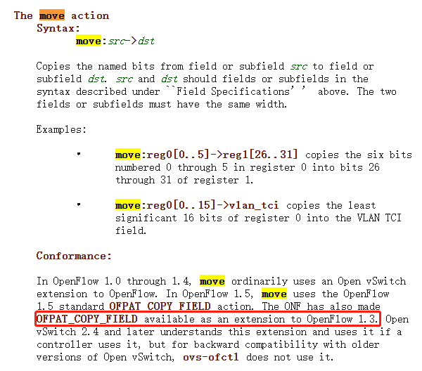
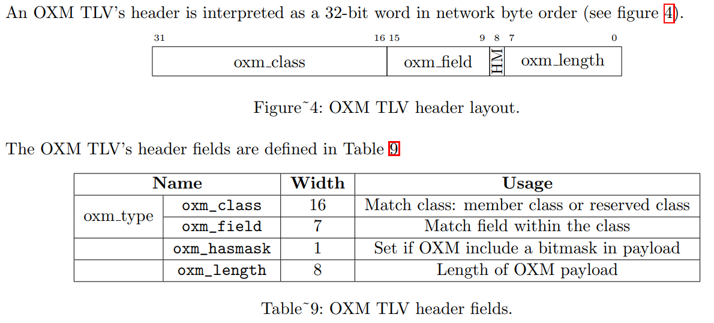

> 本文介绍了如何在自定义控制器中实现OpenFlow Nicira扩展协议

<!--more-->

在开发自定义SDN控制器的过程中，如果要向Open vSwitch下发下面的一条流表：

```shell
ovs-ofctl -O openflow13 add-flow br-int "cookie=0xa,table=20,priority=300,in_port="vxlan",udp,nw_dst="100.95.0.1",tp_dst=53 actions=move:NXM_NX_TUN_IPV4_SRC[]->NXM_NX_REG0[],move:NXM_NX_TUN_ID[0..23]->NXM_NX_REG1[0..23],goto_table:40"
```

就需要构造出符合Openflow协议的二进制数据。通常Openflow相关的library会提供面向开发者友好的构造方法，比如OpenDayLight Openflow Plugin中就用yang生成了可以直接使用的类以及相关的序列化、反序列化方法，基本的Openflow消息格式可以简单的生成，但是有一些Openflow扩展协议，就需要分析协议内容。下面以上面流表为例，分析一下这个过程。

### 1. 查看ovs文档

上面流表中的action使用了move指令，首先从ovs入手，查看帮助文档`man ovs-actions`的move部分：



可看到，move指令是OpenFlow1.3的一个扩展。

### 2. 查看Openflow 1.3扩展文档

从官网查询，copy field指令属于扩展ext-320, 从协议文档中可以查到move指令的基本格式：

```c
/* Action structure for ONFACT_ET_COPY_FIELD. */
struct onf_act_copy_field {
	uint16_t type; /* OFPAT_EXPERIMENTER. */
	uint16_t len; /* Length is padded to 64 bits. */
	uint32_t experimenter; /* ONF_EXPERIMENTER_ID. */
	uint16_t exp_type; /* ONFACT_ET_COPY_FIELD. */
	uint8_t pad2[2];
	uint16_t n_bits; /* Number of bits to copy. */
	uint16_t src_offset; /* Starting bit offset in source. */
	uint16_t dst_offset; /* Starting bit offset in destination. */
	uint8_t pad[2]; /* Align to 32 bits. */
	/* Followed by:
	* - Exactly 8, 12 or 16 bytes containing the oxm_ids, then
	* - Enough all-zero bytes (either 0 or 4) to make the action a whole
	* multiple of 8 bytes in length */
	uint32_t oxm_ids[0]; /* Source and destination OXM headers */
};
OFP_ASSERT(sizeof(struct ofp_action_copy_field) == 20);
```

以ODL为例，控制器提供的序列化方法也跟上述协议对应：

```java
    @Override
    public void serialize(final Action input, final ByteBuf outBuffer) {
        ActionRegMove actionRegMove = (ActionRegMove) input.getActionChoice();
        final int startIndex = outBuffer.writerIndex();
        serializeHeader(EncodeConstants.EMPTY_LENGTH, SUBTYPE, outBuffer);
        outBuffer.writeShort(actionRegMove.getNxActionRegMove().getNBits().toJava());
        outBuffer.writeShort(actionRegMove.getNxActionRegMove().getSrcOfs().toJava());
        outBuffer.writeShort(actionRegMove.getNxActionRegMove().getDstOfs().toJava());
        writeNxmHeader(actionRegMove.getNxActionRegMove().getSrc(), outBuffer);
        writeNxmHeader(actionRegMove.getNxActionRegMove().getDst(), outBuffer);
        writePaddingAndSetLength(outBuffer, startIndex);
    }
```

其中：

- nbits是move的位数
- srcOfs是源地址中，copy起始位置
- dstOfs是目的地址中，copy的其实位置
- oxm_ids是源和目的的两个field引用

现在问题是oxm_ids该用什么值？

### 3. Nicira 扩展中的filed名称

Openvswitch标准文档中有描述filed的TLV格式，以及标准协议中不同field的值：



如果是标准协议中的field，可以直接参考。但是上述流表用了NXM_*开头的field， 这属于nicira扩展，该扩展的信息目前并没有详细的文档。为此，只能在开源的已实现的控制器中寻找标准。

ryu是一个支持Openflow协议的开源控制器（其实主要是比ovs的c代码便于阅读），其代码` ryu/ofproto/nicira_ext.py`中定义了nicira扩展的field标准：

```python
...
NXM_NX_TUN_ID = nxm_header(0x0001, 16, 8)
NXM_NX_TUN_ID_W = nxm_header_w(0x0001, 16, 8)
NXM_NX_TUN_IPV4_SRC = nxm_header(0x0001, 31, 4)
NXM_NX_TUN_IPV4_SRC_W = nxm_header_w(0x0001, 31, 4)
NXM_NX_TUN_IPV4_DST = nxm_header(0x0001, 32, 4)
NXM_NX_TUN_IPV4_DST_W = nxm_header_w(0x0001, 32, 4)
...
```

上面以_w结尾的field，就是带mask的field。并且ryu代码中有field值的计算方式：

```python
def nxm_header__(vendor, field, hasmask, length):
	return (vendor << 16) | (field << 9) | (hasmask << 8) | length

def nxm_header(vendor, field, length):
    return nxm_header__(vendor, field, 0, length)

def nxm_header_w(vendor, field, length):
    return nxm_header__(vendor, field, 1, (length) * 2)
```
自此，我们可以根据ryu的源码，分析出Nicira扩展中的field的值。

### 4 总结

上面通过了一个ovs流表，展示了自定义SDN控制器下发流表时的不确定字段分析方法。
